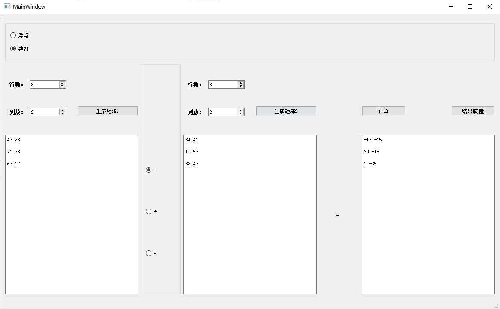
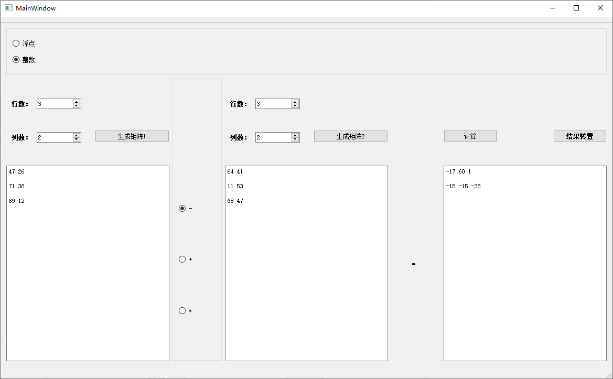
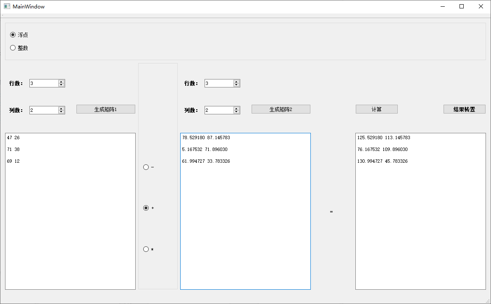
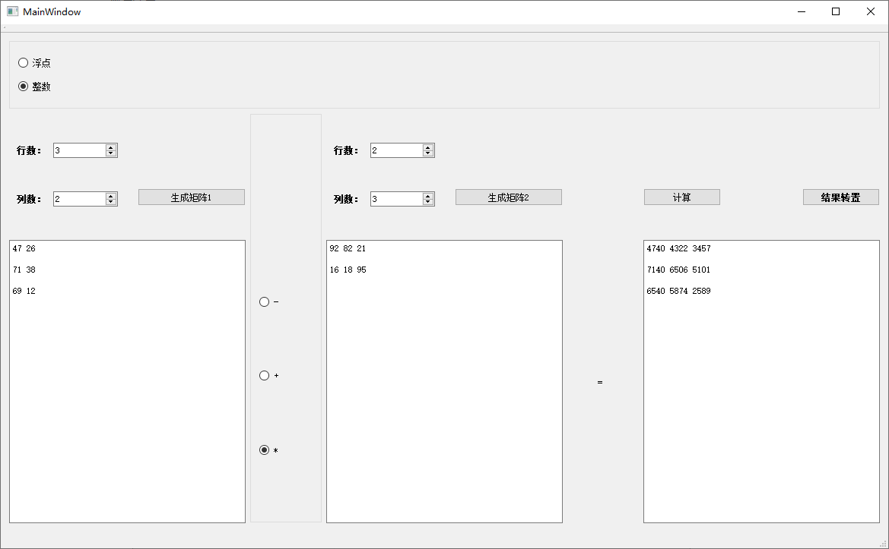

## 概念题

#### 一. 请简述什么是消息驱动的程序结构。

* 每个程序中存在一个消息队列，程序的任何一个动作都是在接收到一条消息后发生的。
* 每个窗口都有一个消息处理函数，程序不断从自己的消息队列中获取信息并调用相应的消息处理函数进行处理。

#### 二. 请简述什么是“文档-视”结构。

* **文档**：用于存储和管理程序中的数据
* **视**：用于显示文档数据以及实现对文档数据进行操作时与用户的交互功能。
* **文档与视一起可以实现**：
    * 数据内部存储形式和外部表现形式相互独立。这使得程序容易设计与维护。
    * 一个文档对象对应一个或多个视对象，即，对于同一个文档数据可以用不同的方式进行显示和操作。

## 编程题

* 简要思路：

    * 设计**Matrix**类，内有**两个二维指针**，一个`int**`，一个`double**`。在定义变量时，传入`bool`型参数，表示该矩阵是整形或是浮点型。
    * 重载`+`，`-`，`*`号，在重载函数中根据两个加数的类型确定结果类型。当且仅当两个加数都是整形时，结果为整形。
    * 根据图形界面上的控件的值，生成随机矩阵，当因为行列不匹配等问题而导致无法进行运算时，点击"**运算**"不产生结果。否则，`delete`上一次的结果，并生成新的结果，使用`to_string`转换为字符串，展示在`QTextBrower`上。
    * 通过`QT Creator`中的`Spacers`，创建出可以保持比例，任意方法缩小的图形界面。

* 测试结果：

    * **整数减法**：

        

    * **转置**：

        

    * **整数与浮点数加法**：

        

    * **整数乘法**：

        