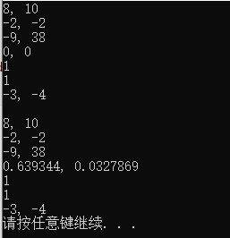

## 概念题

#### 一. 什么是泛型程序设计？泛型程序设计为我们编程带来了怎样的好处？

* 定义：
    * 一个程序实体能**对多种数据进行操作或描述**的特性成为**类属性**，通常包括**类属函数**和**类属类**，而**基于具有类属性的程序实体进行程序设计的技术**称为**泛型程序设计**。
    * 在C++中，类属函数和类属类一般用**模板**实现。
* 好处：
    * 类属是**多态**的一种，成为**参数化多态**。
    * 一段带有类型作为参数的代码，给其提供不同的类型值就能得到多个不同的代码，提供了继承机制以外的另一种抽象机制，能够**方便地实现代码的复用**，减少代码量。
    * 泛型也在一定程度上约束了变量的类型，保证了类型的安全。

#### 二. 什么是函数模板？什么是类模板？当一个类模板被实例化时，会发生什么？

* 函数模板：函数模板是指带有**类型参数**的函数定义。
* 类模板：类模板是指带有**类型参数**的类定义。
* 类模板被实例化时：
    * 程序给模板参数提供一个**类型**作为值。
    * 编译程序对类模板进行**显式**的实例化，根据实参的类型将类模板实例化为具体的类。
    * 在实例化后**不再存在模板类**，只有具体类。


## 编程题

#### 一. 

测试代码：

```cpp
Complex<int> a(3, 4);
Complex<int> b(5, 6);
Complex<int> c(a + b);
Complex<int> d = a - b;
Complex<int> e = a * b;
Complex<int> f(a / b);
Complex<int> m(3, 4);
Complex<int> p = -a;
cout << c << endl << d << endl << e << endl << f << endl << (a == m) << endl << (a != f) << endl << p << endl;
cout << endl;
Complex<double> a2(3, 4);
Complex<double> b2(5, 6);
Complex<double> c2(a2 + b2);
Complex<double> d2 = a2 - b2;
Complex<double> e2 = a2 * b2;
Complex<double> f2(a2 / b2);
Complex<double> m2(3, 4);
Complex<double> p2 = -a2;
cout << c2 << endl << d2 << endl << e2 << endl << f2 << endl << (a2 == m2) << endl << (a2 != f2) << endl << p2 << endl;
```

结果：



