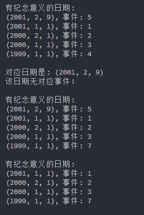

## 概念题

#### 一. 什么是 STL ? 它由哪几部分组成？

* **STL**：
    * STL是C++的**标准模板库**，是C++标准库中以**模板**形式给出的功能。
    * STL实现了**数据结构**和**算法**的**复用**，体现了**泛型程序设计**的精髓。
    * STL支持了一种**编程思维模式**。
* **组成**：主要由**三**部分
    * **容器模板**，用于存储序列化数据元素，如：向量、队列、栈、集合等。
    * **算法(函数)模板**，用于对容器中数据元素进行一些常用的操作，如：排序、查找、求和等。
    * **迭代器模板**，实现了抽象的指针功能，它用于指向容器中的元素，是容器和算法之间的桥梁。

#### 二. 简述 STL 中算法与容器的关系。

* 迭代器是**算法和容器之间的桥梁**。
* 在**STL**中，不是把容器传给算法，而是把容器的**某些迭代器**传给算法，在算法中通过迭代器来访问和遍历容器中的元素。这样能够**提高算法对容器的适应性**，使得**具有相容关系的不同容器的迭代器都能够传给同一个算法。**


## 编程题

#### 一. 

* **思路**：
    * `MeaningfulDate`类存储的是日期与对应的事件，且日期不能够重复，是一种**键-值对**，所以使用`Map`进行存储。因为需要实现日期大小排序，所以提供一个**比较函数作为参数**，使得插入`Map`后便有序。
    * 我选择让**操作返回`bool`型变量**，**由调用者自己决定错误时的操作**。这样增加了类的通用性。

* **测试代码**：

    ```cpp
    MeaningfulDate m;
    Date a(2001, 1, 1);
    Date b(2000, 2, 1);
    Date c(2000, 1, 1);
    Date d(1999, 1, 1);
    Date e(2001, 2, 9);
    m.addDate(a, "事件: 1");
    m.addDate(b, "事件: 2");
    m.addDate(c, "事件: 3");
    m.addDate(d, "事件: 4");
    m.addDate(e, "事件: 5");
    m.addDate(a, "事件: 6");		//插入键相同的键值对，失败
    m.showInOrder();			 //按有意义日期的顺序由大至小打印
    
    Date* date = m.findDate("事件: 5");
    if(date == nullptr){
        cout << "该事件无对应的日期!" << endl;
    }else{						//找到对应事件的日期
        cout << "对应日期是: "<< *date << endl;
    }
    
    string event = m.findEvent(Date(2001, 2, 2));
    if(event == ""){			//找不到对应日期的事件
        cout << "该日期无对应事件!" << endl;
    }else{
        cout << "对应事件是: " << event << endl;
    }
    
    cout << endl;
    
    if(!m.modifyDate(d, "事件: 7")){		//修改成功
        cout << "修改" << d << "失败!该日期没有事件!" << endl;
    }
    m.showInOrder();
    
    if(m.deleteDate(e) <= 0){			 //删除成功
        cout << "删除" << d << "失败!" << endl;
    }
    m.showInOrder();
    ```

* **结果**：

    